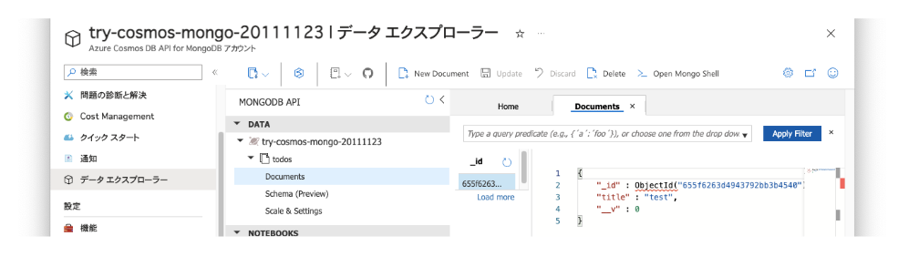

# try-cosmos-db-mongo-api

## はじめに
MongoDB用APIを利用してAzure Cosmos DBに対するシンプルなCRUDを作るサンプルです

## 前提

* Macを利用します

```
$ sw_vers
ProductName:		macOS
ProductVersion:		13.5.2
BuildVersion:		22G91
```

* Azureのアカウントが作成されていること

## やってみたこと

### 必要なライブラリのインストール

```shell
$ npm init -y
$ npm install express mongoose body-parser dotenv --save
```

### Azure CosmosDBの設定

- Azure Portalにログインし、Cosmos DBアカウントを作成します。
- 作成にあたり、APIオプションでMongoDB APIを選択します。
- 必要な情報（URLとプライマリキー）を取得します。

### .envファイルの作成

```
code .env
```

以下の内容を埋めた内容で作成します。

```.env
COSMOSDB_USER = "<fill me>"
COSMOSDB_PASSWORD = "<fill me>"
COSMOSDB_DBNAME = "<fill me>"
COSMOSDB_HOST= "<fill me>"
COSMOSDB_PORT=10255
```

参考に、コンソールの表示との対応付けのスクショを貼ります。


### メインロジックの作成

```
code app.js
```

### cURLによる動作確認

```
node app.js
```
```
$ curl -X POST -H "Content-Type: application/json" -d '{"title":"test"}' http://localhost:3000/todos
{"title":"test","_id":"655f6263d4943792bb3b4540","__v":0}
```
```
$ curl -X GET http://localhost:3000/todos
[{"_id":"655f6263d4943792bb3b4540","title":"test","__v":0}]
```

ついでにデータエクスプローラからも確認できます



## 参考

* Node.js Mongoose アプリケーションを Azure Cosmos DB に接続する | Microsoft Learn https://learn.microsoft.com/ja-jp/azure/cosmos-db/mongodb/connect-using-mongoose