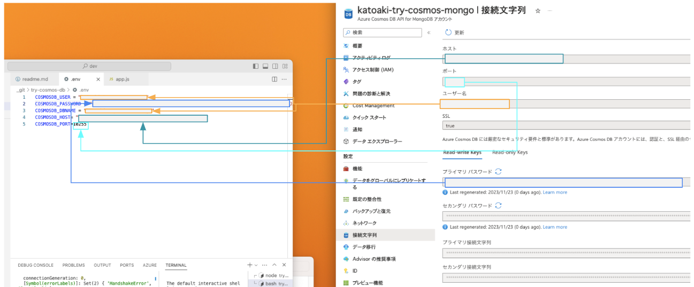

# try-cosmos-db-mongo-api

## はじめに
MongoDB用APIを利用してAzure Cosmos DBに対するシンプルなCRUDを作るサンプルです

## 前提

* Azureのアカウントが作成されていること
* 

## やってみたこと

### 必要なライブラリのインストール

### Azure CosmosDBの設定

### .envファイルの作成

以下の内容を埋めた内容で作成します。

```.env
COSMOSDB_USER = "<fill me>"
COSMOSDB_PASSWORD = "<fill me>"
COSMOSDB_DBNAME = "<fill me>"
COSMOSDB_HOST= "<fill me>"
COSMOSDB_PORT=10255
```

参考に、コンソールの表示との対応付けのスクショを貼ります。



### メインロジックの作成

### cURLによる動作確認


## 最後に

## 参考

* Node.js Mongoose アプリケーションを Azure Cosmos DB に接続する | Microsoft Learn https://learn.microsoft.com/ja-jp/azure/cosmos-db/mongodb/connect-using-mongoose